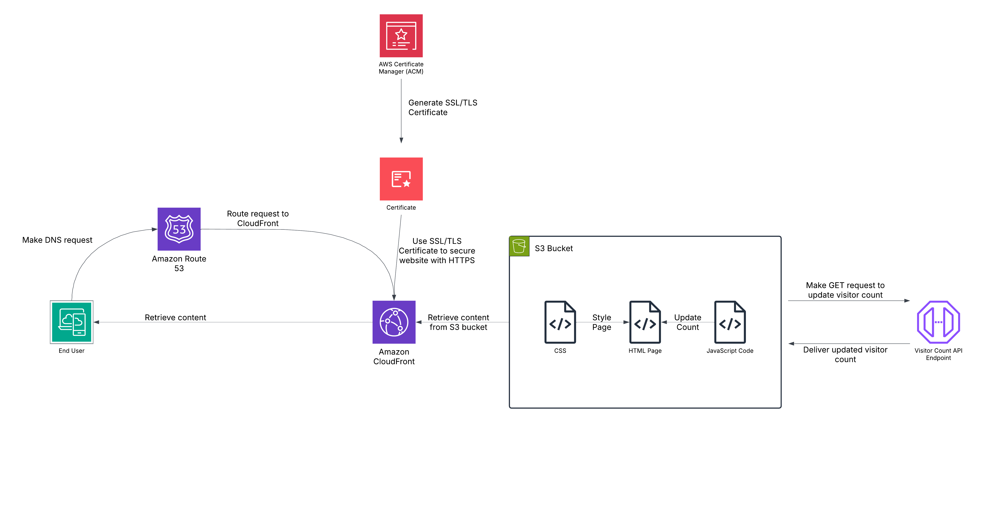

# Cloud Resume Challenge: Front-End

## S3 Bucket

An AWS S3 Bucket is set up to hold the resume HTML page, a CSS file to style said page, and JavaScript function files to supply the visitor count to the page and add interactivity.

## CloudFront

A CloudFront (CF) distribution is used to secure access to the website (S3 Bucket) with HTTPS. A Policy is used to restrict access to the S3 bucket unless it's through HTTPS. The CF distribution points to the S3 bucket and retrieves content from it.

## Route 53

Route 53 used to create a Hosted Zone and provide name servers to route DNS requests to the CloudFront Distribution

## Amazon Certificate Manager

The Amazon Certificate Manager (ACM) is used to generate a SSL/TLS Certificate so CloudFront can use it to secure the website with HTTPS.

## CI/CD

On push, the Github Actions workflow will run to synchronize the S3 bucket with the contents of this Git repository, updating all modified files and deleting any files no longer present in the repository.
